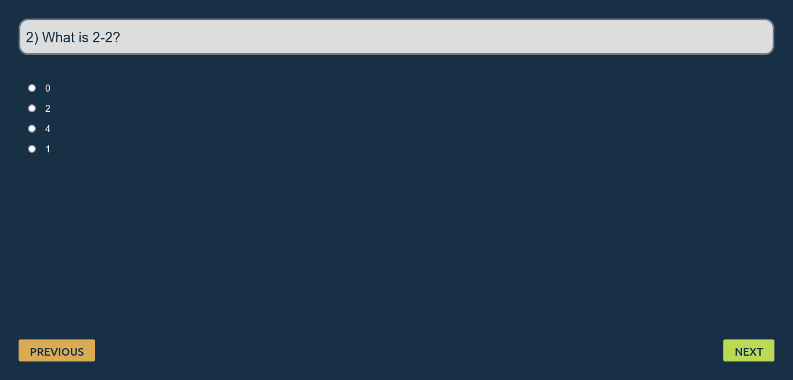

# Quiz app made by [Me](https://www.github.com/vshal-ch)

## Table of contents

- [Overview](#overview)
  - [The challenge](#the-requirements)
  - [Screenshot](#desktop-screenshot)
  - [Links](#links)
  - [Built with](#built-with)
## Overview

### The requirements

Users should be able to:

- View the optimal layout for the game depending on their device's screen size
- Take quiz and view score of his/her test

### Desktop Screenshots

### Mobile Screenshot

### Links

- Live Site URL: [Quiz app](https://vshal-ch.github.io/Quiz-app)
- Me: [Vishal ch](https://www.github.com/vshal-ch)

### Built with

- Semantic HTML5 markup
- CSS custom properties
- Position
- CSS Grid
- Mobile-first workflow
- JavaScript